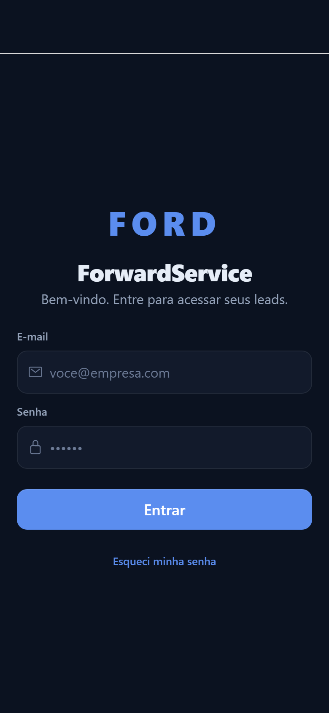
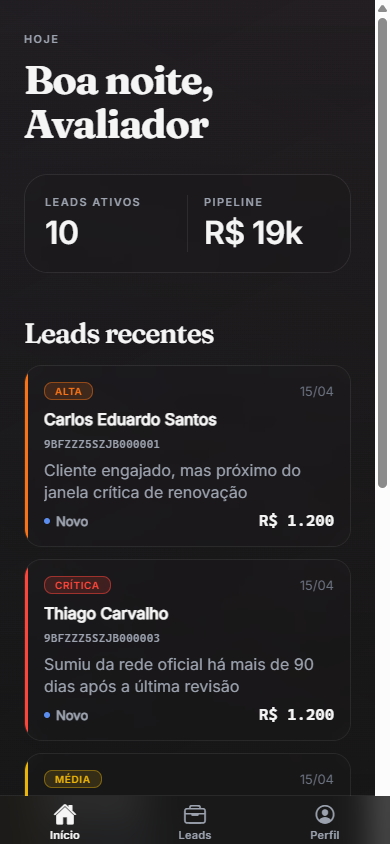
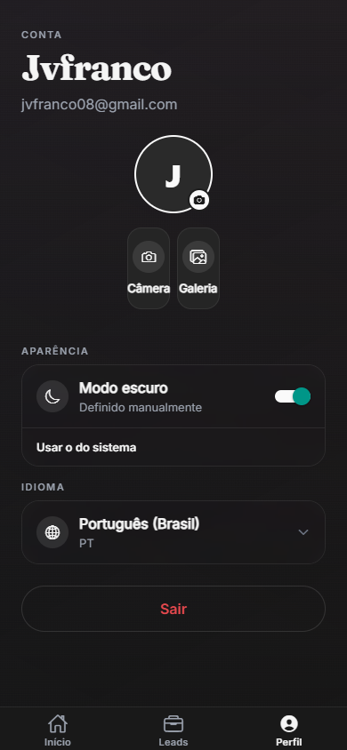
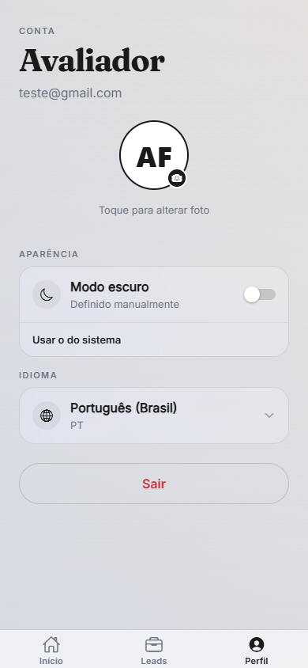

# ForwardService Mobile


> **App mobile da plataforma ForwardService — solução do grupo para o Desafio 02 (VIN Share / Retenção pós-venda) do Challenge Ford × FIAP 2026.**

App React Native + Expo voltado para o **atendente da concessionária**: ele abre o app, vê os leads do dia com priorização baseada em churn score, entra no detalhe e atua (ligar, mensagem, marcar contato). O objetivo é fazer o atendente recuperar clientes que estão prestes a abandonar a rede oficial Ford de manutenção.

---

## Índice

1. [Sobre o Projeto](#1-sobre-o-projeto)
2. [Integrantes do Grupo](#2-integrantes-do-grupo)
3. [Demonstração Visual](#3-demonstração-visual)
4. [Como Rodar o Projeto](#4-como-rodar-o-projeto)
5. [Decisões Técnicas](#5-decisões-técnicas)
6. [Próximos Passos](#6-próximos-passos) _(próximo commit)_
7. [Apêndice — Conventions & Troubleshooting](#7-apêndice--conventions--troubleshooting) _(próximo commit)_

---

## 1. Sobre o Projeto

### Desafio escolhido

**Desafio 02 — Impulsionando o VIN Share na América do Sul com Soluções Inteligentes.**

A Ford perde participação no mercado de pós-venda à medida que seus veículos envelhecem: o cliente faz a primeira revisão na rede oficial, e a partir daí migra para oficinas independentes em busca de preço, conveniência ou simplesmente porque "esqueceu" do timing da próxima manutenção. O **VIN Share** é a métrica que captura essa fatia — quantos veículos da base ativa estão de fato sendo atendidos pela rede oficial em um dado período.

Escolhemos esse desafio porque ele combina três coisas que valorizamos como grupo:

- **Problema real e dimensionável** — não é "smart cidade genérica", é uma métrica que a Ford acompanha trimestralmente.
- **Espaço para ML e dados** — segmentação comportamental + classificação preditiva têm encaixe direto, e o Sprint 1 já entrega uma versão simplificada do score na home do app.
- **Ponta operacional clara** — o atendente da concessionária é o "última milha". Sem uma ferramenta mobile que prioriza o trabalho dele, qualquer modelo de ML morre antes de gerar impacto.

### Onde o app entra na solução

A plataforma **ForwardService** é composta de 6 repositórios (backend Java, ML Python, web SvelteKit, infra, docs e este mobile). O `forward-mobile` é a **interface do atendente** — quem efetivamente atua sobre o lead. O fluxo é:

```text
ML (forward-ml)  ──── churn score por VIN ────►  API (forward-api-java)
                                                          │
                                                          ▼
                                              ┌───────── Mobile (este repo) ─────────┐
                                              │  Atendente prioriza, contata, fecha. │
                                              └──────────────────────────────────────┘
                                                          │
                                                          ▼
                                              VIN Share recuperado ✓
```

### Funcionalidades implementadas no Sprint 1

| # | Funcionalidade | Estado | Observação |
|---|---------------|--------|------------|
| 1 | **Login com email + senha** | ✅ | Autenticação via Supabase Auth, sessão persistida com `expo-secure-store` |
| 2 | **Dashboard (Home)** | ✅ | Saudação contextual (manhã/tarde/noite), KPIs de Leads Ativos e Pipeline em BRL, lista de leads recentes |
| 3 | **Lista de Leads** | ✅ | Filtros por status (Todos, Críticos, Hoje, Esquecidos 30d+), busca por VIN ou motivo, contagem por chip |
| 4 | **Detalhe do Lead (Vista 360 v1)** | ✅ | VIN, prioridade, razão do score, pipeline esperado, ações (Ligar, Mensagem, Marcar contato) |
| 5 | **Perfil do usuário** | ✅ | Avatar com upload (Câmera ou Galeria via `expo-image-picker`), persistência em Supabase Storage |
| 6 | **Tema Dark/Light** | ✅ | Toggle manual + opção "Usar tema do sistema", persistência local em AsyncStorage |
| 7 | **Internacionalização (i18n)** | ✅ | Português (Brasil) por padrão + Inglês, detecção automática do locale do device, picker manual |
| 8 | **Design System "Glass Minimalist"** | ✅ | Tipografia serif (Fraunces) + sans (Inter), paleta Ford Blue, mesh gradient background, primitivo `GlassSurface` |
| 9 | **Pull-to-refresh** | ✅ | Em Home e Leads, com haptic feedback via `expo-haptics` |
| 10 | **Tratamento de erro com retry** | ✅ | `ErrorBanner` reutilizável, toasts em validação de form |

Funcionalidades que **estão preparadas mas dependem do backend** (Sprint 2):

- Botão **Ligar** abre `tel:` URI nativo, mas o número do cliente vem do customer enrichment (endpoint `GET /customers/{id}` ainda não retorna telefone validado).
- Botão **Mensagem** está stub — Sprint 2 dispara WhatsApp via N8N.
- Botão **Marcar contato** está stub — Sprint 2 grava histórico de outreach.

### Conformidade com o spec da disciplina

| Requisito do PDF do Prof. Hércules Ramos | Atendido? |
|-------------------------------------------|-----------|
| React Native + Expo (recomendado) | ✅ Expo SDK 55 |
| App multiplataforma (iOS + Android) | ✅ Mesmo bundle, validado em ambos |
| Pelo menos 1 fonte de dados externa via API | ✅ `forward-api-java` (Spring Boot, Fly.io) + Supabase Auth/Storage |
| Componentes React Native + gerenciamento de estado | ✅ Composição via primitivos + Context API para tema/i18n/auth |
| Expo Router | ✅ File-based routing com typed routes |
| APIs assíncronas | ✅ Cliente tipado em `lib/api.ts` com retry e auto-attach de token |
| Diferencial: storage local | ✅ `expo-secure-store` para token, `AsyncStorage` para tema/locale |
| Diferencial: sensores | ⚠️ Parcial — uso de Câmera via `expo-image-picker` para avatar |
| Diferencial: notificações | 🟡 Backlog Sprint 2 (`expo-notifications` planejado) |

---

## 2. Integrantes do Grupo

| Nome completo | RM | GitHub |
|---------------|-----|--------|
| João Victor Franco | 556790 | [@jvfranco08](https://github.com/jvfranco08) |
| Lucca Saraiva Borges | 554608 | [@lucksza](https://github.com/lucksza) |
| Ruan Melo Vieira | 557599 | [@DevRuanVieira](https://github.com/DevRuanVieira) |
| Rodrigo César Jimenez | 558148 | [@roji-menez](https://github.com/roji-menez) |

> **Turma:** 3º ano — Engenharia de Software FIAP
> **Disciplina:** Mobile Development & IoT — Prof. Hércules Ramos
> **Sprint:** 1 (única do semestre) — entrega 24/05/2026

---

## 3. Demonstração Visual

> **Atenção avaliador:** todas as prints abaixo foram tiradas do app rodando via Expo (web target), com dados reais vindos do `forward-api-java` em produção (Fly.io). Cada tela é mostrada em modo **escuro** e **claro** para comprovar o suporte dual ao tema.

### 3.1 Fluxo principal em GIF

> _GIF do fluxo principal (login → home → leads → detalhe → registrar contato) será adicionado aqui antes da gravação do vídeo final._

📁 [`docs/screenshots/`](docs/screenshots/)

### 3.2 Login

O atendente entra com seu email corporativo. A validação é inline; erros vêm como toast no topo. A logomarca **FORD** e o nome **ForwardService** aparecem em tipografia serif (Fraunces) para reforçar a identidade do produto.

| Dark | Light |
|------|-------|
|  |  |

### 3.3 Home (Dashboard)

Saudação contextual ("Boa tarde, Jvfranco08") + dois KPIs que respondem "o que eu preciso fazer hoje?": **Leads Ativos** (quantos casos abertos atribuídos a mim) e **Pipeline** (valor estimado em BRL — formatado em "k"/"M" para evitar overflow). Lista de leads recentes ordenada por prioridade.

| Dark | Light |
|------|-------|
|  |  |

### 3.4 Leads

Lista completa com 4 filtros via chips (mostram contagem em tempo real) e busca por VIN ou motivo. Cada card mostra prioridade colorida (ALTA / CRÍTICA / MÉDIA / BAIXA), VIN, razão do score, status e pipeline.

| Dark |
|------|
|  |

> _Print clara de Leads será adicionada antes da entrega final (em geração)._

### 3.5 Detalhe do Lead (Vista 360 v1)

VIN no topo, badges de prioridade e status, "Por que este lead" (razão do score do modelo de ML), pipeline esperado. As três ações de outreach ficam num footer fixo: **Ligar**, **Mensagem**, **Marcar contato**.

| Dark | Light |
|------|-------|
|  |  |

### 3.6 Perfil

Avatar circular com badge de upload (toca para abrir Câmera ou Galeria), nome amigável + email, toggle de **Modo escuro** com opção "Usar tema do sistema", picker de **Idioma** (PT-BR / EN) e ação destrutiva de **Sair**.

| Dark | Light |
|------|-------|
|  |  |

---

## 4. Como Rodar o Projeto

### 4.1 Pré-requisitos

| Ferramenta | Versão mínima | Notas |
|------------|---------------|-------|
| Node.js | 18 LTS ou 20 LTS | Verifique com `node --version` |
| npm | 9+ | Já vem com Node 18+ |
| Git | qualquer recente | Para clonar o repo |
| Expo Go (device físico) | última versão | Android Play Store ou iOS App Store — device precisa estar no **mesmo Wi-Fi** do computador |
| Chrome / Edge / Safari | qualquer recente | Para o caminho mais rápido (`npm run web`) |

**Opcional (só para emuladores):**

| Ferramenta | Quando precisa |
|------------|----------------|
| Android Studio + AVD | Se quiser rodar em emulador Android |
| Xcode + Simulator | macOS apenas, se quiser rodar em iOS Simulator |

> **Bom saber:** nenhum SDK nativo (Android/iOS) é necessário para rodar via **Expo Go** ou **web**. O caminho mais rápido leva menos de 2 minutos em qualquer sistema operacional.

### 4.2 Caminho mais rápido — Expo Go + backend de produção (recomendado)

```bash
# 1. Clonar o repositório
git clone https://github.com/fwd-ford/forward-mobile.git
cd forward-mobile

# 2. Instalar dependências
npm install

# 3. Iniciar o Expo dev server
npm run start
```

Sem nenhum `.env`, o app aponta para a API em produção (`https://forward-api-java.fly.dev`) e para o projeto Supabase oficial. **Funciona out-of-the-box** para qualquer avaliador.

**Como abrir no celular:**

1. Instale o **Expo Go** (Play Store / App Store)
2. Garanta que o celular está no **mesmo Wi-Fi** do PC
3. Abra o Expo Go e escaneie o QR code que apareceu no terminal (Android) ou use a Câmera do iOS

### 4.3 Caminho alternativo — Web (sem celular)

```bash
npm install
npm run web
# abre http://localhost:8081
```

Útil para avaliadores que não querem instalar o Expo Go. **Limitações:** o `expo-secure-store` cai em fallback (localStorage), e algumas APIs nativas como push notifications não estão disponíveis.

### 4.4 Caminho alternativo — Emulador Android

```bash
npm install
npm run android     # exige Android Studio com um AVD aberto
```

### 4.5 Caminho alternativo — iOS Simulator (macOS apenas)

```bash
npm install
npm run ios         # exige Xcode com Simulator aberto
```

### 4.6 Apontando para backend local (opcional)

Para apontar o app para uma instância local do `forward-api-java`:

```bash
cp .env.example .env
```

Edite `.env` conforme o cenário:

| Cenário | `EXPO_PUBLIC_API_URL` |
|---------|----------------------|
| Web ou iOS Simulator | `http://localhost:8080` |
| Android Emulator | `http://10.0.2.2:8080` |
| Expo Go em device físico | `http://<IP-do-PC>:8080` (ex: `http://192.168.1.42:8080`) |
| Docker compose (forward-infra) | `http://<IP-do-PC>:18080` |

Depois: `npm run start -- --clear` (o cache do Metro precisa de reset quando `.env` muda).

### 4.7 Credenciais de teste

> _Para o avaliador testar o app sem precisar criar conta:_

| Email | Senha |
|-------|-------|
| _(será enviado por canal privado ao professor)_ | _(idem)_ |

Alternativamente, criar uma conta nova pelo Supabase Auth (link "Criar conta" no login) também funciona — o app provisiona um profile vazio automaticamente.

---

## 5. Decisões Técnicas

### 5.1 Stack escolhida e justificativa

| Camada | Tecnologia | Por que essa? |
|--------|------------|---------------|
| Framework | **React Native via Expo (SDK 55, managed workflow)** | Spec da disciplina exige React Native + Expo. Managed workflow elimina prebuild local — o app instala e roda em qualquer máquina sem Xcode/Android Studio configurado. |
| Linguagem | **TypeScript strict mode** | Tipos catch bugs em refatorações e a API tipada (`lib/api.ts`) garante que nenhum endpoint quebra silenciosamente. |
| Navegação | **Expo Router** com typed routes | File-based routing reduz boilerplate de configuração. Typed routes evitam erros de navegação em tempo de compilação. |
| Estado | **React Context API** (auth, theme, i18n) + estado local | Sem Redux/Zustand — o escopo do Sprint 1 não justifica o overhead. Contextos resolvem com 0 dependências extras. |
| Auth | **Supabase Auth** com `expo-secure-store` | Auth gerenciado pelo Supabase reduz superfície de segurança crítica. Token persistido encriptado no Keychain (iOS) ou Keystore (Android). |
| Storage local | **AsyncStorage** (tema, locale) + **SecureStore** (token) | Princípio: dado sensível vai pro SecureStore; preferência vai pro AsyncStorage. |
| Estilo | **StyleSheet do RN + theme tokens** em `lib/theme.ts` | Sem styled-components/Tailwind — StyleSheet é otimizado em runtime e mantém o bundle enxuto. Tokens centralizados garantem consistência. |
| i18n | **i18next + react-i18next** | Padrão de facto no ecossistema React. Detecção automática de locale (`navigator.language` no web, `NativeModules` em mobile). |
| Tipografia | **`@expo-google-fonts/fraunces` + `@expo-google-fonts/inter`** | Carregamento via `useFonts()` cacheia após primeiro load. Fraunces (serif) para títulos, Inter (sans) para corpo. |
| Backend principal | **`forward-api-java`** (Spring Boot 3, hospedado em Fly.io) | Backend oficial do projeto. App consome via REST tipado. |
| Backend secundário | **Supabase** (Auth + Storage + Postgres) | Auth + upload de avatar + tabela de profiles. Aproveitamos o ecossistema BaaS para economizar tempo no Sprint 1. |

### 5.2 Estrutura do projeto

```text
forward-mobile/
├── app/                          # Rotas (Expo Router file-based)
│   ├── (tabs)/                   # Bottom tab navigator
│   │   ├── _layout.tsx
│   │   ├── index.tsx             # Home: leads do dia + KPIs + pull-to-refresh
│   │   ├── leads.tsx             # Lista filtrada de leads
│   │   └── profile.tsx           # Perfil: avatar + tema + locale + sair
│   ├── lead/[id].tsx             # Detalhe do lead (Vista 360 v1)
│   ├── login.tsx                 # Tela de autenticação
│   └── _layout.tsx               # Root stack + providers (theme, i18n, auth)
│
├── components/
│   ├── ui/                       # Primitivos genéricos e reutilizáveis
│   │   ├── Button.tsx
│   │   ├── Card.tsx
│   │   ├── Badge.tsx
│   │   ├── GlassSurface.tsx      # Primitivo de superfície "Glass Minimalist"
│   │   ├── ScreenHeader.tsx
│   │   ├── ErrorBanner.tsx       # Erro reutilizável com retry
│   │   └── FooterAction.tsx
│   └── domain/                   # Componentes acoplados ao domínio Ford
│       ├── LeadCard.tsx
│       └── MetricCard.tsx
│
├── context/                      # Providers globais (Auth, Theme, i18n)
│
├── lib/
│   ├── api.ts                    # Cliente tipado pro forward-api-java (auto-attach de token)
│   ├── supabase.ts               # Cliente Supabase com SecureStore como adapter
│   ├── auth.ts                   # useSession() hook + sign in/out
│   ├── theme.ts                  # Tokens (cores, spacing, radius, tipografia)
│   ├── formatBRL.ts              # Helper canônico para moeda
│   └── displayName.ts            # Friendly name (full_name → email → "Bem-vindo")
│
├── hooks/                        # Hooks customizados
│
├── i18n/
│   ├── index.ts                  # Bootstrap + detecção de locale
│   ├── en.json
│   └── pt-BR.json
│
├── docs/
│   ├── screenshots/              # Prints de todas as telas (Demonstração Visual)
│   └── SETUP_PROFILES_AVATARS.md # Migration do bucket de avatars no Supabase
│
├── assets/                       # Ícones, splash, fontes
├── app.json / app.config.js      # Manifest do Expo
├── package.json
├── tsconfig.json                 # strict mode + path alias @/*
└── README.md
```

### 5.3 Integrações com APIs externas

#### `forward-api-java` (REST)

Endpoint base configurável via `EXPO_PUBLIC_API_URL`. Cliente em [`lib/api.ts`](lib/api.ts) usa `fetch` com:

- **Auto-attach do bearer token** — toda request puxa o token via `getAccessToken()` do contexto de auth. Isso elimina a classe de bugs "esqueci de passar o token" (que era a causa do P0 de auth no Lead Detail).
- **Tipagem completa** das responses com `interface` por endpoint.
- **Tratamento centralizado de erro** — status >= 400 vira erro tipado com mensagem amigável.

Endpoints consumidos no Sprint 1:

- `GET /leads` — lista paginada de leads
- `GET /leads/{id}` — detalhe de um lead
- `GET /customers/{id}` — enrichment do cliente

#### Supabase (Auth + Storage + Postgres)

- **Auth:** `signInWithPassword`, `signOut`, sessão persistida com adapter customizado para `expo-secure-store`.
- **Storage:** bucket `avatars` para upload de foto de perfil (Câmera ou Galeria via `expo-image-picker`).
- **Postgres direto:** tabela `profiles` lida pelo app via SDK. Outras leituras (customers, leads) passam pela API Java — Supabase direto serve só para dados de perfil do próprio usuário, respeitando RLS.

#### CORS / TLS

API Java tem `ALLOWED_ORIGINS` configurado para incluir `http://localhost:8081` (web dev) e o domínio Fly.io. TLS é gerenciado pelo Fly. App nunca faz request via HTTP em produção.

### 5.4 Decisões arquiteturais relevantes

1. **Sem dependência de backend para rodar localmente** — qualquer dev pode `npm install && npm start` e ver o app funcionando porque o default aponta para produção. Onboarding zero-friction.

2. **Glass Minimalist como design system próprio** — em vez de usar uma UI lib como NativeBase ou React Native Paper, construímos primitivos próprios (`GlassSurface`, `Card`, `Badge`, `Button`) baseados em tokens centralizados em `lib/theme.ts`. Isso garante identidade visual única e evita o "app genérico de tutorial".

3. **Tipografia serif intencional** — usar Fraunces (serif) nos títulos foi uma decisão estética para diferenciar o app de SaaS genéricos. A Ford tem identidade premium; o app reflete isso.

4. **Detecção de locale automática + override manual** — o app respeita o idioma do device por padrão, mas dá ao usuário a opção de forçar PT/EN no Perfil. Salva no AsyncStorage para persistir entre sessões.

5. **Pull-to-refresh em vez de WebSocket** — para o escopo do Sprint 1, refetch sob demanda é suficiente e mais simples de auditar. WebSocket para updates em tempo real entra no Sprint 2.

6. **Helpers canônicos em `lib/`** — `formatBRL`, `ACTIVE_LEAD_STATUSES`, `friendlyDisplayName` foram extraídos depois que viramos a primeira rodada de QA. Antes estavam duplicados; agora são fonte única de verdade. Aprendizado: a duplicação aparece rápido quando se tem 5 telas, vale a pena refatorar cedo.

### 5.5 Qualidade — verificação local

```bash
npx tsc --noEmit       # type check (sem build)
npm run lint           # ESLint
```

CI roda **Gitleaks** em todo push para impedir vazamento de credenciais. Type check é validado em cada PR.

---

## Licença

Projeto acadêmico — Challenge Ford × FIAP 2026. Uso restrito à avaliação da disciplina.
