# ForwardService Mobile


> **App do atendente da concessionária na plataforma ForwardService.** É a solução do grupo para o Desafio 02 do Challenge Ford × FIAP 2026 (VIN Share / retenção no pós-venda).

O atendente abre o app e vê os leads do dia, priorizados pelo risco de abandono calculado pelo modelo de ML. Ele entra no detalhe e age: liga, manda WhatsApp com mensagem pronta e registra o avanço no funil (contato → conversão). Cada ação volta para a API e alimenta o ciclo de dados da Ford.

---

## Índice

1. [Download e instalação do APK](#1-download-e-instalação-do-apk)
2. [Fluxos do desafio e o que cada tela faz](#2-fluxos-do-desafio-e-o-que-cada-tela-faz)
3. [Demonstração visual](#3-demonstração-visual)
4. [Arquitetura](#4-arquitetura)
5. [Identidade visual](#5-identidade-visual)
6. [Como rodar em desenvolvimento](#6-como-rodar-em-desenvolvimento)
7. [Como gerar o APK](#7-como-gerar-o-apk)
8. [Segurança e LGPD no app](#8-segurança-e-lgpd-no-app)
9. [Qualidade e roteiro de teste](#9-qualidade-e-roteiro-de-teste)
10. [Estrutura do projeto](#10-estrutura-do-projeto)
11. [Limitações conhecidas e próximos passos](#11-limitações-conhecidas-e-próximos-passos)
12. [Integrantes](#12-integrantes)

---

## 1. Download e instalação do APK

| Item | Valor |
|---|---|
| Versão | **3.0.1** (versionCode 4), Sprint 3 |
| Download | Página de [Releases](https://github.com/fwd-ford/forward-mobile/releases/latest), arquivo `ForwardService-v3.0.1.apk` |
| Android | 7.0+ (minSdk 24). ABIs `arm64-v8a` (celulares) e `x86_64` (emulador) |
| Pacote | `com.fwdford.forwardservice` |

**Instalar num celular Android**
1. Abra o link da Release no celular e baixe o `.apk`.
2. Permita "instalar apps de fontes desconhecidas" para o navegador, quando o Android pedir.
3. Toque em **Instalar** e abra o **ForwardService**.

**Instalar num emulador (Android Studio)**

```bash
adb install -r ForwardService-v3.0.1.apk
```

**Como entrar**

| Opção | Como | Quando usar |
|---|---|---|
| **Login real (JWT)** | `atendente@forward.dev` / `Forward@2026`. O link "Usar usuário de teste" preenche os campos. Também há `atendente2@forward.dev` (outra concessionária) e `gestor@forward.dev`, com a mesma senha. O `admin@forward.dev` só existe em produção com uma senha própria definida no deploy | Quando a API ([forward-api-java](https://github.com/fwd-ford/forward-api-java)) estiver no ar |
| **Modo demonstração** | Botão "Explorar em modo demonstração" na tela de login | Sem internet ou com o servidor fora do ar. Usa dados fictícios, e o funil funciona igual |

---

## 2. Fluxos do desafio e o que cada tela faz

| # | Fluxo | Telas | Integração |
|---|---|---|---|
| F1 | **Autenticação** com JWT e perfis | Intro → Login | `POST /api/v1/auth/login` devolve o JWT (HS256, com expiração), que fica no SecureStore. Um 401 derruba a sessão |
| F2 | **Priorização do dia** | Home: saudação, KPIs de pipeline e leads críticos | `GET /api/v1/leads` (a API filtra pela concessionária do token) |
| F3 | **Carteira de leads** com busca e filtros | Leads: busca + filtros por status | `GET /api/v1/leads?status=` |
| F4 | **Visão do lead**: cliente, veículo, risco e valor | Detalhe do lead | `GET /api/v1/leads/{id}` e `GET /api/v1/customers/{id}` |
| F5 | **Ação de retenção**: ligar, WhatsApp e avançar o funil | Rodapé do detalhe | `tel:`, `wa.me` com mensagem pronta e `PATCH /api/v1/leads/{id}` (`new/assigned → contacted → converted`; transição inválida = 409) |
| F6 | **Perfil e preferências** | Perfil: foto (câmera/galeria), papel e concessionária do JWT, tema claro/escuro, idioma PT/EN, cidade, sair | Local (SecureStore/AsyncStorage) |

Perfis de acesso (quem manda é o backend): **ATENDENTE** vê e atua nos leads da própria concessionária; **GESTOR** também registra eventos de serviço; **ADMIN** (Ford) vê todas as concessionárias e gerencia usuários.

---

## 3. Demonstração visual

Capturas do **APK de release rodando no emulador Android** (Pixel, Android 15, GPU do host), em `docs/screenshots/android/`. As capturas antigas da Sprint 1 (web) estão em `docs/screenshots/sprint1-web/`.

| Login | Servidor indisponível → modo demo | Home |
|---|---|---|
|  | 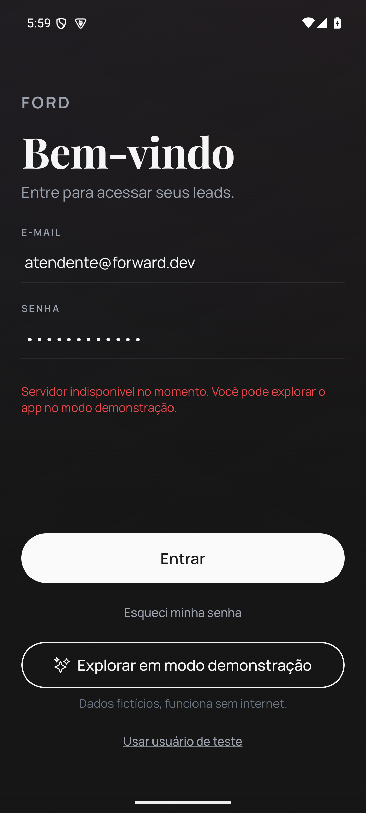 | 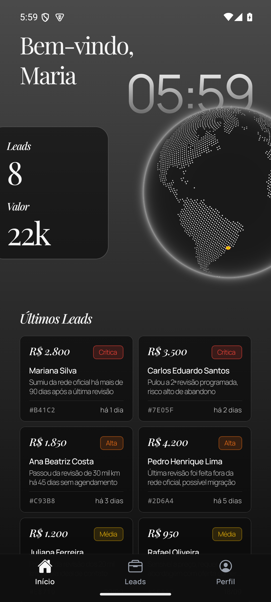 |

| Leads | | |
|---|---|---|
| 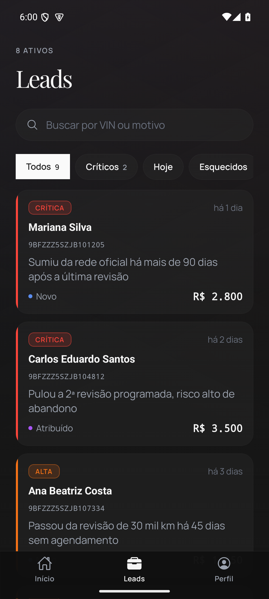 | | |

| Detalhe do lead | Status atualizado | Perfil |
|---|---|---|
| 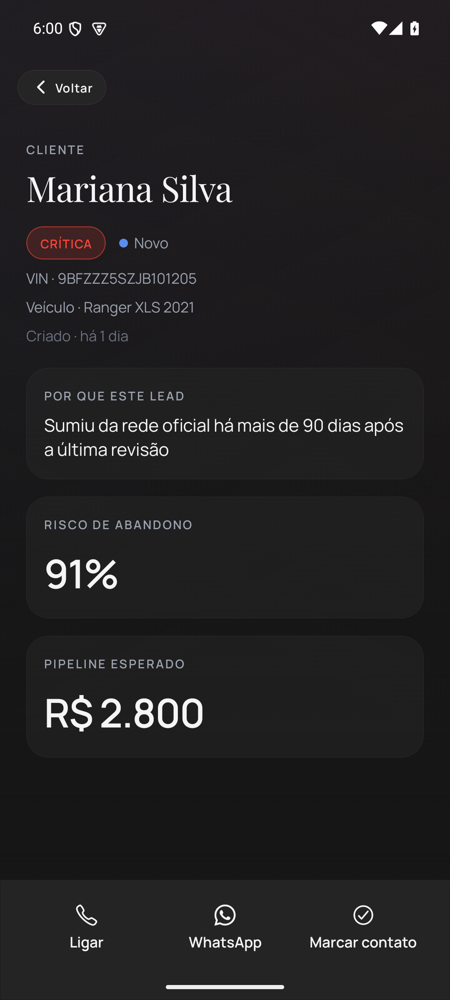 | 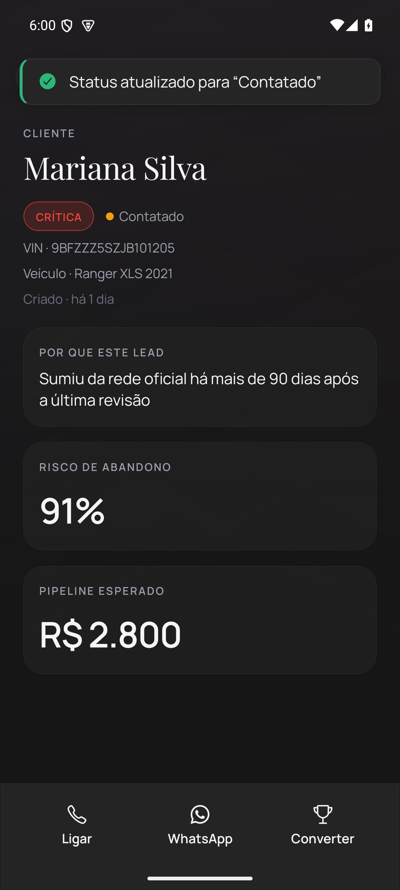 | 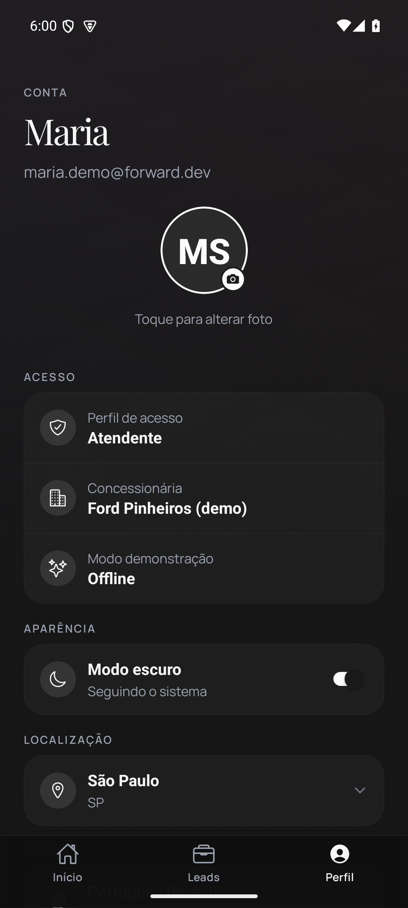 |

| Tema claro: Home | Tema claro: Detalhe |
|---|---|
| 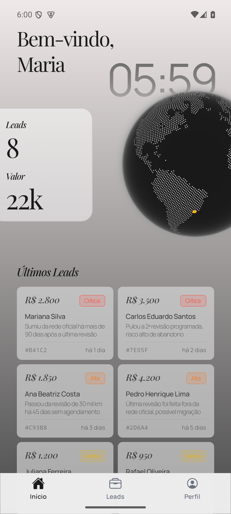 | 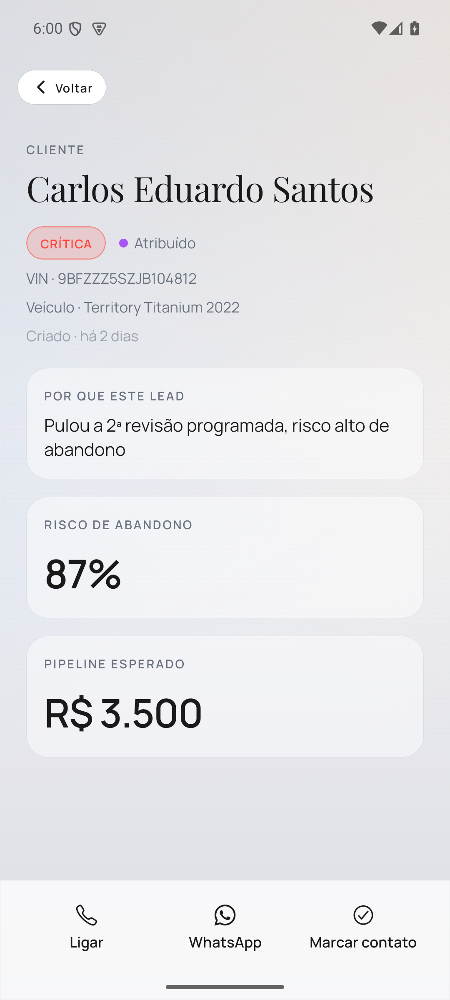 |

**Integração real com a forward-api-java (JWT)**: o APK logado como `atendente@forward.dev`, com os dados da concessionária dele vindos da API e o status persistido via `PATCH /api/v1/leads/{id}`.

| Detalhe (dados da API) | Status salvo na API | Perfil com o papel do JWT |
|---|---|---|
| 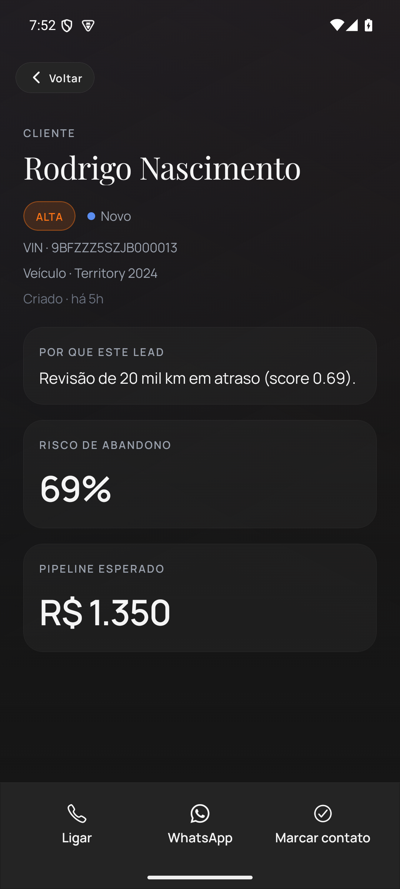 | 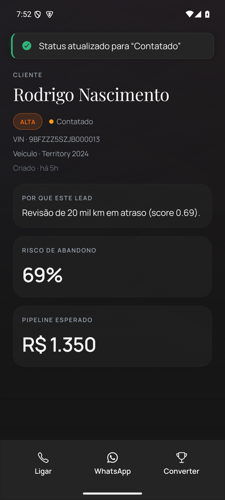 | 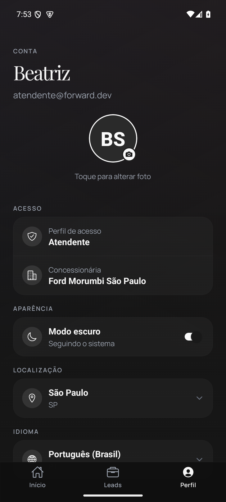 |

---

## 4. Arquitetura

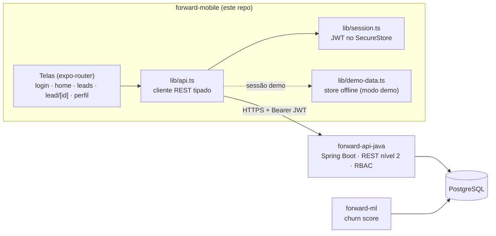
```mermaid
flowchart LR
  subgraph App["forward-mobile (este repo)"]
    UI["Telas (expo-router)<br/>login · home · leads · lead/[id] · perfil"]
    API["lib/api.ts<br/>cliente REST tipado"]
    S["lib/session.ts<br/>JWT no SecureStore"]
    D["lib/demo-data.ts<br/>store offline (modo demo)"]
    UI --> API
    API --> S
    API -. sessão demo .-> D
  end
  API -- "HTTPS + Bearer JWT" --> J["forward-api-java<br/>Spring Boot · REST nível 2 · RBAC"]
  J --> PG[("PostgreSQL")]
  ML["forward-ml<br/>churn score"] --> PG
```

- **Um único backend.** Todas as chamadas vão para a forward-api-java (hospedada no Render, com banco PostgreSQL no Supabase), que valida o JWT, aplica o perfil (ATENDENTE/GESTOR/ADMIN) e restringe os dados à concessionária do usuário. O app não acessa o banco direto.
- **Sessão** (`lib/session.ts`): o token, a validade e os dados do usuário ficam criptografados no **SecureStore** (Android Keystore). O token expira e é descartado antes de ser reenviado. Um 401 limpa a sessão e o roteador volta ao login.
- **Modo demonstração** (`lib/demo-data.ts`): usa os mesmos formatos da API e faz as mutações em memória, então todos os fluxos funcionam sem rede.
- **Regras do funil** (`lib/lead-status.ts`): são as mesmas transições que a API valida.

---

## 5. Identidade visual

| Elemento | Decisão |
|---|---|
| Estilo | *Glass minimalist*: superfícies translúcidas sobre fundo mesh, dark como padrão e light completo |
| Tipografia | **Playfair Display** para títulos (serif editorial) e **Manrope** para a interface, pré-carregadas antes da primeira tela |
| Cores | Tokens centralizados em `lib/theme.ts` (paletas light/dark). O laranja `#F97316` marca destaque e ação, e o azul Ford fica restrito à marca |
| Componentes | `GlassSurface`, `LeadCard`, `FooterAction`, `SettingRow`, `Toast`, `ErrorBanner`, `Skeleton`, todos consumindo os mesmos tokens |
| Ícone e splash | Monograma "F" em Playfair com o ponto laranja de "forward" (`assets/images/`) |
| Idiomas | PT-BR (padrão) e EN, detectados pelo aparelho e alteráveis no Perfil |

---

## 6. Como rodar em desenvolvimento

Pré-requisitos: Node 20+ e npm. Para rodar no Android, também é preciso o Android Studio (SDK + emulador) ou o app Expo Go.

```bash
git clone https://github.com/fwd-ford/forward-mobile.git
cd forward-mobile
npm ci
npx expo start            # a = Android, w = web
```

**Backend local (opcional).** Suba a API com `./mvnw spring-boot:run -Dspring-boot.run.profiles=demo` (veja o README da forward-api-java) e crie um `.env`:

| Variável | Exemplo | Uso |
|---|---|---|
| `EXPO_PUBLIC_API_URL` | `http://10.0.2.2:8080` (emulador) · `http://192.168.x.x:8080` (celular na mesma rede) | URL da API. Padrão: `https://forward-api-java.onrender.com` (Render) |
| `ALLOW_HTTP` | `1` | Só em builds de teste local: libera HTTP. O APK oficial é HTTPS-only |

---

## 7. Como gerar o APK

O build usa CNG (Continuous Native Generation): a pasta `android/` é gerada por `expo prebuild` e não fica versionada.

### 7.1 Local, com Gradle (usado nesta entrega)

```bash
npm ci
npx expo prebuild -p android --clean
cd android
./gradlew assembleRelease -PreactNativeArchitectures=arm64-v8a,x86_64
# saída: android/app/build/outputs/apk/release/app-release.apk
```

Requer JDK 17 e o Android SDK (`ANDROID_HOME`). O NDK é baixado pelo Gradle na primeira vez.

### 7.2 Expo EAS Build

```bash
npx eas-cli login
npx eas-cli build -p android --profile preview   # perfil "preview" do eas.json gera .apk
```

### 7.3 GitHub Actions

O workflow [`android-apk.yml`](.github/workflows/android-apk.yml) faz o mesmo build numa máquina limpa. Ele roda manualmente (*Run workflow*) ou a cada tag `v*`, e numa tag anexa o APK e o SHA-256 à Release.

---

## 8. Segurança e LGPD no app

| Controle | Onde |
|---|---|
| JWT criptografado em repouso (SecureStore/Keystore), nunca em AsyncStorage | `lib/session.ts` |
| Expiração respeitada no cliente (margem de 30 s); 401 limpa a sessão | `lib/auth.ts`, `lib/api.ts` |
| APK de release HTTPS-only (cleartext bloqueado via `expo-build-properties`) | `app.config.js` |
| Timeout por requisição (20 s; 75 s no login por causa do *cold start* do plano gratuito do Render), ping de aquecimento ao abrir o app e erro amigável quando o backend cai | `lib/api.ts`, `app/_layout.tsx` |
| Validação de entrada no login (formato de e-mail e limites de tamanho) | `lib/validation.ts`, `app/login.tsx` |
| Minimização de dados: a foto de perfil fica só no aparelho, e o WhatsApp exige ação do atendente (nada é enviado sozinho) | `lib/profile.ts`, `app/lead/[id].tsx` |
| Permissões mínimas: só câmera; microfone e overlay bloqueados | `app.json` |

---

## 9. Qualidade e roteiro de teste

- **CI** (`.github/workflows/ci.yml`): typecheck (`tsc --noEmit`) + secrets scan (gitleaks) em cada PR.
- **Roteiro manual executado no APK de release (emulador Pixel, Android 15):**

| # | Passo | Esperado | Resultado |
|---|---|---|---|
| 1 | Abrir o app | Intro → Login | ✅ |
| 2 | Login com credenciais inválidas | Mensagem "E-mail ou senha inválidos." | ✅ |
| 3 | Servidor fora do ar | Aviso + botão de modo demonstração destacado | ✅ |
| 4 | Entrar com JWT (API local) e no modo demo | Home com saudação e leads priorizados da concessionária do usuário | ✅ |
| 5 | Aba Leads, filtrar por status, abrir um lead | Detalhe com cliente, veículo, risco e valor | ✅ |
| 6 | Marcar contato, depois Converter | Toast de sucesso e status atualizado | ✅ |
| 7 | Perfil: trocar tema e idioma | UI atualiza na hora | ✅ |
| 8 | Sair | Volta ao login e a sessão é apagada | ✅ |

---

## 10. Estrutura do projeto

```text
app/                  telas (expo-router): login, (tabs)/index|leads|profile, lead/[id]
components/ui/        design system (GlassSurface, Toast, SettingRow, SafeBoundary…)
components/domain/    componentes de negócio (LeadCard, LeadCardCompact…)
context/              ThemeContext, LocaleContext, UserLocationContext
lib/                  api.ts, auth.ts, session.ts, demo-data.ts, lead-status.ts, theme.ts…
i18n/                 pt-BR.json, en.json (+ polyfill Intl.PluralRules para Hermes)
assets/               ícone, adaptive icon, splash, vídeo de intro
eas.json              perfis EAS (preview = APK)
.github/workflows/    ci.yml (typecheck + secrets) e android-apk.yml (build do APK)
```

---

## 11. Limitações conhecidas e próximos passos

- A foto de perfil é local ao aparelho (escolha de LGPD); a sincronização entre aparelhos fica para depois.
- Esqueci a senha: o reset é feito pelo administrador (ADMIN) via API; não há fluxo self-service no app.
- Notificações push de novos leads (Expo Push) e modo offline com fila de sincronização estão no roadmap (Sprints 5 e 6).
- O APK é assinado com a chave de debug do template (distribuição interna/avaliação). Para a Play Store, é preciso um keystore próprio via EAS.

---

## 12. Integrantes

| Nome completo | RM | GitHub |
|---|---|---|
| João Victor Franco | 556790 | [@jvfranco08](https://github.com/jvfranco08) |
| Lucca Saraiva Borges | 554608 | [@lucksza](https://github.com/lucksza) |
| Ruan Melo Vieira | 557599 | [@DevRuanVieira](https://github.com/DevRuanVieira) |
| Rodrigo César Jimenez | 558148 | [@roji-menez](https://github.com/roji-menez) |
| Bruno Leão | 555563 | — |

Turma 3ESPZ (Engenharia de Software, FIAP). Disciplina: Mobile Development & IoT, Prof. Hércules Ramos. Challenge Ford × FIAP 2026, Sprint 3.

## Licença

Projeto acadêmico. Uso restrito ao Challenge Ford × FIAP 2026.
